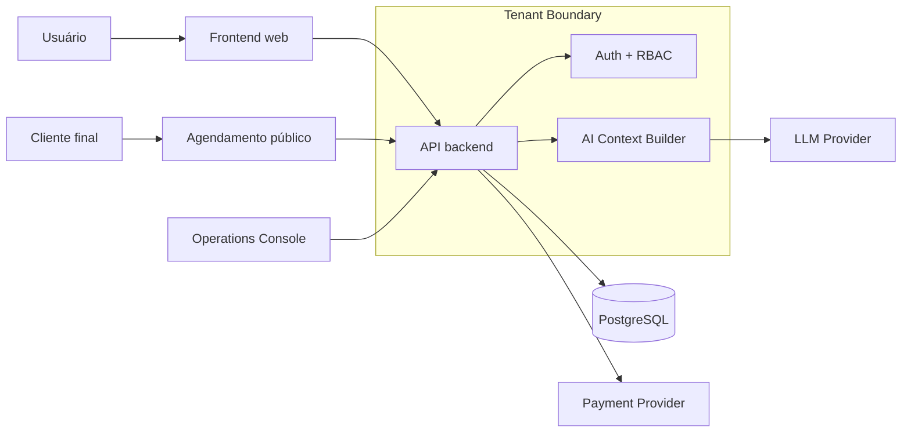
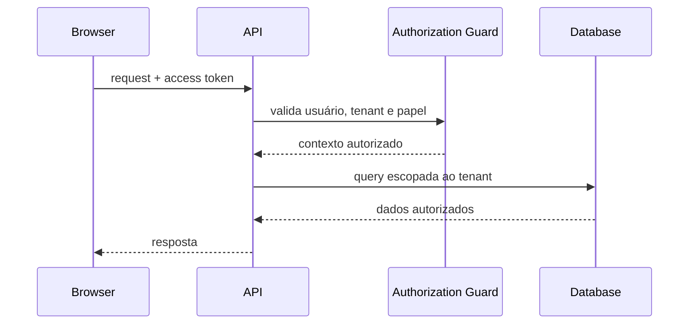

# Axis Core — Technical Case Study

> Case técnico público de uma plataforma SaaS multi-tenant para gestão de operações de serviços.
>
> **Este repositório não contém o código-fonte de produção.** Ele documenta decisões de engenharia, arquitetura e exemplos deliberadamente simplificados para portfólio.

## Por que este repositório existe

O Axis Core nasceu como um produto real e evoluiu de um CRUD tradicional para uma aplicação com requisitos de produção: multi-tenancy, agenda concorrente, billing, autorização por papéis, fluxo público de agendamento, integrações externas, IA contextual e ferramentas internas de operação.

Criei este case para demonstrar **engenharia de software e arquitetura** sem publicar regras comerciais, credenciais, código proprietário, prompts internos, esquemas completos ou detalhes operacionais sensíveis do produto.

## Stack utilizada no projeto

| Camada | Tecnologias |
|---|---|
| Frontend | React, TypeScript, Vite |
| Backend | Python, FastAPI |
| ORM / migrations | SQLAlchemy, Alembic |
| Banco | PostgreSQL |
| Auth | JWT + refresh session |
| Billing | API de provedor de pagamentos |
| IA | API de provedor de LLM |
| Deploy | PaaS em nuvem |
| Testes | Pytest + validações TypeScript |

> Integrações e provedores específicos foram generalizados neste case. O objetivo é demonstrar o desenho técnico, não documentar a infraestrutura comercial do produto.

## Visão geral da arquitetura



## Principais desafios de engenharia

### 1. Multi-tenancy e autorização

A aplicação separa dados por tenant e diferencia níveis de acesso no backend. A autorização não depende apenas da interface.

**Objetivo:** impedir leitura ou mutação acidental de dados entre contas.

Leia: [docs/multi-tenancy.md](docs/multi-tenancy.md)

### 2. Integridade de agenda sob concorrência

Checar disponibilidade apenas na aplicação não é suficiente: duas requisições podem passar pela mesma validação ao mesmo tempo. Por isso, além da validação de UX, existe uma barreira transacional no banco para impedir sobreposição de reservas ativas.

**Resultado:** conflitos permanecem protegidos mesmo em condições de corrida.

Leia: [docs/architecture.md](docs/architecture.md) e [examples/appointment_conflict.sql](examples/appointment_conflict.sql)

### 3. Billing idempotente

Pagamentos assíncronos exigem assumir que eventos podem ser reenviados ou processados mais de uma vez. O fluxo de billing usa identificadores externos e processamento idempotente para evitar efeitos duplicados.

Leia: [docs/billing.md](docs/billing.md)

### 4. IA com contexto autorizado

A IA não recebe acesso direto ao banco nem liberdade para executar consultas. A aplicação aplica autorização, seleciona apenas dados permitidos e produz um contexto reduzido antes da chamada ao modelo.

**Princípio:** o LLM trabalha sobre contexto preparado pela aplicação, nunca sobre a fonte bruta de dados.

Leia: [docs/ai-integration.md](docs/ai-integration.md)

### 5. Ferramentas internas de operação

Além do produto, foi criada uma console interna para diagnóstico, rastreabilidade e ações administrativas controladas. O case mostra apenas uma versão sanitizada dessa interface.


Leia: [docs/observability-and-support.md](docs/observability-and-support.md)

## Fluxo de uma requisição autenticada



## Decisões arquiteturais documentadas

- [ADR-001 — PostgreSQL como banco de produção](docs/decisions/ADR-001-postgresql.md)
- [ADR-002 — Integridade atômica da agenda](docs/decisions/ADR-002-atomic-scheduling.md)
- [ADR-003 — IA baseada em snapshot autorizado](docs/decisions/ADR-003-ai-authorized-snapshot.md)
- [ADR-004 — Webhooks idempotentes](docs/decisions/ADR-004-idempotent-webhooks.md)

## Segurança

O case documenta controles em nível conceitual, entre eles:

- isolamento multi-tenant no backend;
- autorização por papel e recurso;
- sessões com rotação e cookies protegidos;
- tokens públicos com escopo limitado;
- preços e efeitos financeiros validados no servidor;
- minimização de dados antes de chamadas à IA;
- proteção transacional contra conflitos de agenda;
- validação de configuração em ambiente de produção.

Leia: [docs/security.md](docs/security.md)

## Exemplos de código

A pasta [`examples/`](examples/) contém exemplos **didáticos e propositalmente genéricos** de alguns padrões utilizados no projeto:

- escopo de tenant e autorização;
- defesa contra sobreposição concorrente de reservas;
- processamento idempotente de evento externo;
- criação de contexto mínimo para IA.

Eles não são cópias do código de produção e usam nomes, entidades e regras simplificadas.

## O que este case demonstra

- desenho de APIs REST;
- modelagem e migrations;
- PostgreSQL e constraints de integridade;
- autenticação, autorização e multi-tenancy;
- integração com APIs externas;
- idempotência e tratamento de eventos assíncronos;
- integração de IA com controle de contexto;
- frontend administrativo em React/TypeScript;
- preocupação com observabilidade e operação;
- evolução arquitetural guiada por riscos reais do produto.

## O que não está neste repositório

Por decisão de segurança e propriedade intelectual, este repositório **não publica**:

- código-fonte completo do frontend ou backend;
- secrets, tokens, variáveis de produção ou URLs privadas;
- schema completo do banco;
- regras comerciais internas e roadmap;
- prompts internos completos;
- dados reais de clientes;
- endpoints administrativos privados;
- implementações completas de billing, IA ou suporte;
- detalhes de infraestrutura que não sejam necessários para o case.

## Estrutura

```text
axis-core-case-study/
├── README.md
├── NOTICE.md
├── SECURITY.md
├── PUBLICATION_CHECKLIST.md
├── docs/
│   ├── architecture.md
│   ├── multi-tenancy.md
│   ├── security.md
│   ├── billing.md
│   ├── ai-integration.md
│   ├── observability-and-support.md
│   ├── interview-notes.md
│   ├── screenshots/
│   └── decisions/
└── examples/
    ├── README.md
    ├── tenant_scope.py
    ├── appointment_conflict.sql
    ├── idempotent_webhook.py
    └── ai_context_builder.py
```

## Status

Case técnico em evolução. A plataforma real permanece em repositório privado.

---

**Autor:** Kayki Molina  
**Objetivo do case:** demonstrar experiência prática em desenvolvimento backend/full-stack e arquitetura de aplicações SaaS.
