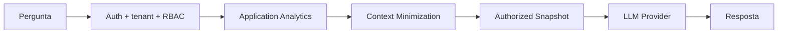

# Integração de IA

## Objetivo

Permitir perguntas operacionais em linguagem natural sem entregar ao modelo acesso irrestrito às fontes de dados da aplicação.

## Arquitetura conceitual

## O modelo não consulta o banco diretamente

O LLM não recebe credenciais, conexão de banco ou liberdade para escolher consultas. A aplicação é responsável por decidir quais métricas e registros o usuário pode utilizar como contexto.

Isso mantém autorização e acesso a dados em código determinístico, fora do modelo.

## Minimização

Por padrão, o contexto analítico evita dados pessoais desnecessários. Campos não necessários à pergunta também podem ser removidos conforme o papel do usuário.

## Contexto conversacional

A interface utiliza apenas o contexto necessário para a interação atual. Métricas técnicas de consumo podem ser registradas separadamente do conteúdo conversacional.

## Resiliência

A aplicação pode manter respostas operacionais básicas independentes do provedor de IA para que indisponibilidade externa não bloqueie funções essenciais.

Veja [`../examples/ai_context_builder.py`](../examples/ai_context_builder.py).
