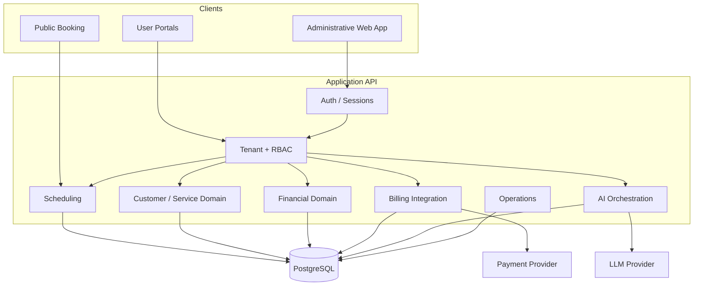
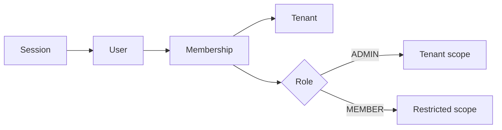
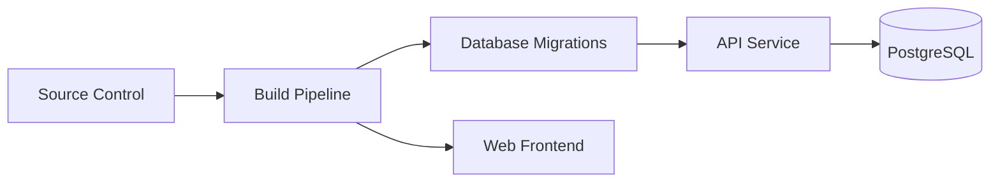

# Arquitetura

## Contexto

O Axis Core é uma plataforma SaaS para operações de serviços com agenda, clientes, profissionais, financeiro, fluxo público de agendamento, billing e uma camada de IA.

A aplicação foi organizada como um **modular monolith**: uma API com módulos bem definidos compartilhando o mesmo banco relacional. Para o estágio atual do produto, isso reduz complexidade operacional sem impedir separação de responsabilidades.

## Componentes conceituais



O diagrama é propositalmente de alto nível. Nomes de serviços, rotas, filas, jobs, tabelas e infraestrutura comercial não são publicados neste case.

## Por que modular monolith

Microservices adicionariam custos de observabilidade, deploy, consistência distribuída e infraestrutura antes de existir uma necessidade clara de escalabilidade independente por domínio.

No estágio atual, a prioridade é:

1. fronteiras de domínio claras;
2. regras críticas protegidas por invariantes transacionais;
3. integrações encapsuladas;
4. migrations reproduzíveis;
5. testes automatizados;
6. capacidade de extrair serviços futuramente se métricas justificarem.

## Requisições multi-tenant

Toda operação autenticada parte de um usuário e um tenant. O backend valida o vínculo do usuário e produz um contexto de autorização.



## Agenda e concorrência

A disponibilidade é checada na aplicação para gerar mensagens amigáveis, mas a integridade final pertence ao banco.

```text
App validation -> transaction -> database invariant -> commit
```

Se duas requisições concorrentes tentarem reservar o mesmo recurso no mesmo intervalo, apenas uma deve persistir.

## Deploy

Frontend e backend são entregues separadamente. O processo de release inclui migrations antes da nova versão da API assumir tráfego.


