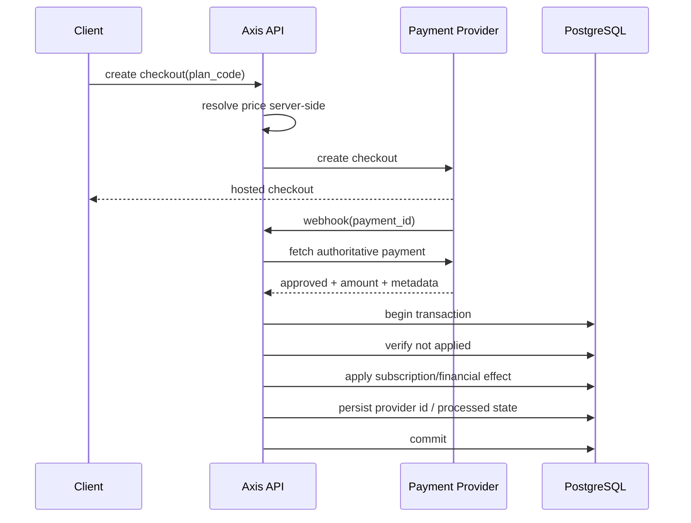

# Billing e idempotência

## Problema

Gateways de pagamento trabalham de forma assíncrona. Um webhook pode:

- ser reenviado;
- chegar depois de uma consulta manual;
- ser processado simultaneamente por duas instâncias;
- chegar com status ainda pendente;
- referenciar um pagamento já aplicado.

Logo, "recebi webhook = aplicar efeito" não é uma estratégia segura.

## Fluxo conceitual

## Regras

- o navegador envia o identificador do plano, não um preço confiável;
- o backend valida valor/currency/metadata antes de aplicar efeitos;
- o identificador de pagamento do provedor deve ter unicidade;
- reprocessar o mesmo evento deve produzir o mesmo estado final;
- efeitos financeiros não devem ser duplicados.

Veja [`../examples/idempotent_webhook.py`](../examples/idempotent_webhook.py).
