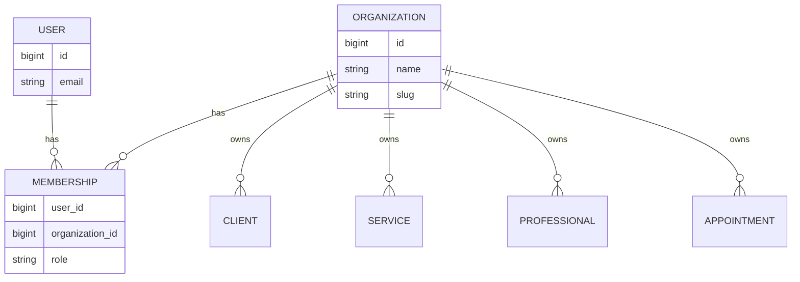

# Multi-tenancy e RBAC

## Modelo conceitual

O tenant principal é uma `Organization`. Usuários se vinculam a organizações por `Membership`.



## Regra principal

Nunca confiar em um `organization_id` vindo do navegador como prova de autorização.

O backend resolve a combinação:

```text
authenticated user + requested organization -> membership -> role -> allowed scope
```

## Admin x Professional

**ADMIN** pode acessar o escopo da organização de acordo com a funcionalidade.

**PROFESSIONAL** recebe escopo reduzido. Em agenda e analytics, por exemplo, o backend restringe operações ao próprio perfil profissional quando aplicável.

## Defesa em profundidade

A proteção não depende de uma única camada:

1. rotas exigem autenticação;
2. membership é validada;
3. role é validada;
4. queries incluem `organization_id`;
5. recursos específicos são verificados contra o mesmo tenant;
6. a interface também esconde ações não permitidas, mas apenas como UX — não como segurança.

Veja um exemplo simplificado em [`../examples/tenant_scope.py`](../examples/tenant_scope.py).
